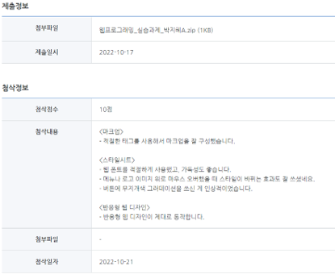

<div width="100%" height="100%" align="center">
  
<h1 align="center">
  <p align="center">🎸반응형 웹사이트 메인 페이지 </p>
  <a href="jeehay28.github.io/guitar-studio/">
    
  </a>
 </h1>
</div>

<br>
<br>

## 💡 Introduction

- **개발 기간**
  > 2022.10.14 ~ 2022.10.17

- **개발 환경**
  > HTML, CSS


<br> 
<br> 

## 🎨 Development
- **주제 선택 배경**
  > 1.5개월 동안 HTML/CSS 과정 수강 후, 제작한 첫 번째 프로젝트

  > 실용성 있는 웹사이트를 만들면 좋을 것 같아 기타 레슨을 하는 지인의 웹사이트를 제작했음

- **향후 계획(안)**
  > (계획 안) about : 기타교습소 소개

  > (계획 안) lessons : 가입신청 폼

  > (계획 안) contact : 모바일 & facebook 페이지

  > (계획 안) 버튼(beginner, intermediate, more advanced) : 과정 별 연주 목록

- **로고 및 히어로 이미지 컨셉**
  > 어린이, 기타를 연상 시키는 이미지

  > 밝고 재밌는 느낌을 주는 분위기

- **메뉴**
  > about, lessons, contact
  > 마우스 오버 시 밑줄 효과

- **버튼**
  > beginner, intermediate, more advanced

  > 마우스 오버 시 무지개색 변화 효과

- **폰트**
  > 구글 폰트 : Poppins, Allura

- **중단점**
  > 브라우저 크기가 786px 이하인 버튼의 디스플레이 방식 변경

- **파비콘**
  > 주제를 대표하는 기타 아이콘 선택

<br> 
<br> 

## ✅ Completion
- **메인 페이지**
  > 로고 및 히어로 이미지 컨셉 
  > - 초등학교 방과 후 교실 같은 어린이 대상의 기타레슨을 운영을 나타내는 이미지 선택
  > - 귀엽고 음악을 연상 시키는 기타를 연주하는 새 이미지를 선택
  > - 마우스 오버하면 로고가 좌우로 움직이는 효과 
    ```
    .logo a img:hover {
        transform: rotateY(150deg);
        transition : all;
    }
    ```
 
  > 메뉴 : 가독성을 높이고자 배경색의 투명도를 조정
  ```
    .navbar ul {
    display: flex;
    justify-content: center;
    background-color: rgba(174, 203, 13, 0.39);
    border-radius: 20px;
    }
    ```

  > 중단점(768px)이하의 브라우저에서는 한 줄에 한 개씩 버튼 표시
  ```
   .buttons {
    display: flex;
    flex-direction: column;
    align-items: center;
    gap: 20px;
    }
  ```

<br> 
<br> 

## 👏 Evaluation
- **자체 평가의견**
  > 히어로 이미지의 다양한 색깔에 글씨가 잘 드러나지 않아 가독성을 높이고자 메뉴에 투명한 배경색을 설정했음

  > 로고나 버튼에 마우스 오버 시 재미를 주기 위해 움직임이거나 무지개색 그라데이션 효과를 주었음 

  > [Markup Validation Service](https://validator.w3.org/) 마크업 유효성 검사
  

- **고경희 지도강사 평가의견**
  > 8년 연속 웹 분야 1위 도서인 "Do it HTML+CSS+자바스크립트 웹 표준의 정석"을 비롯해 지금까지 40여 종의 책을 집필한 저자

  > 
